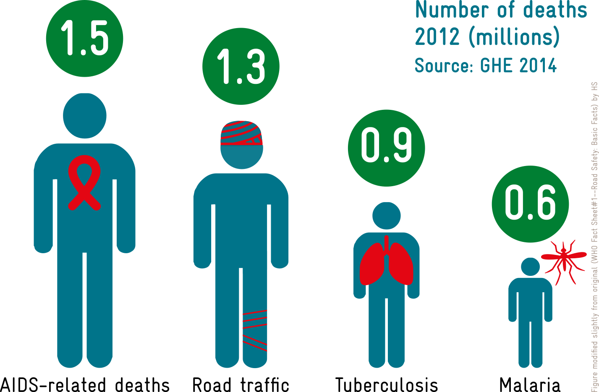
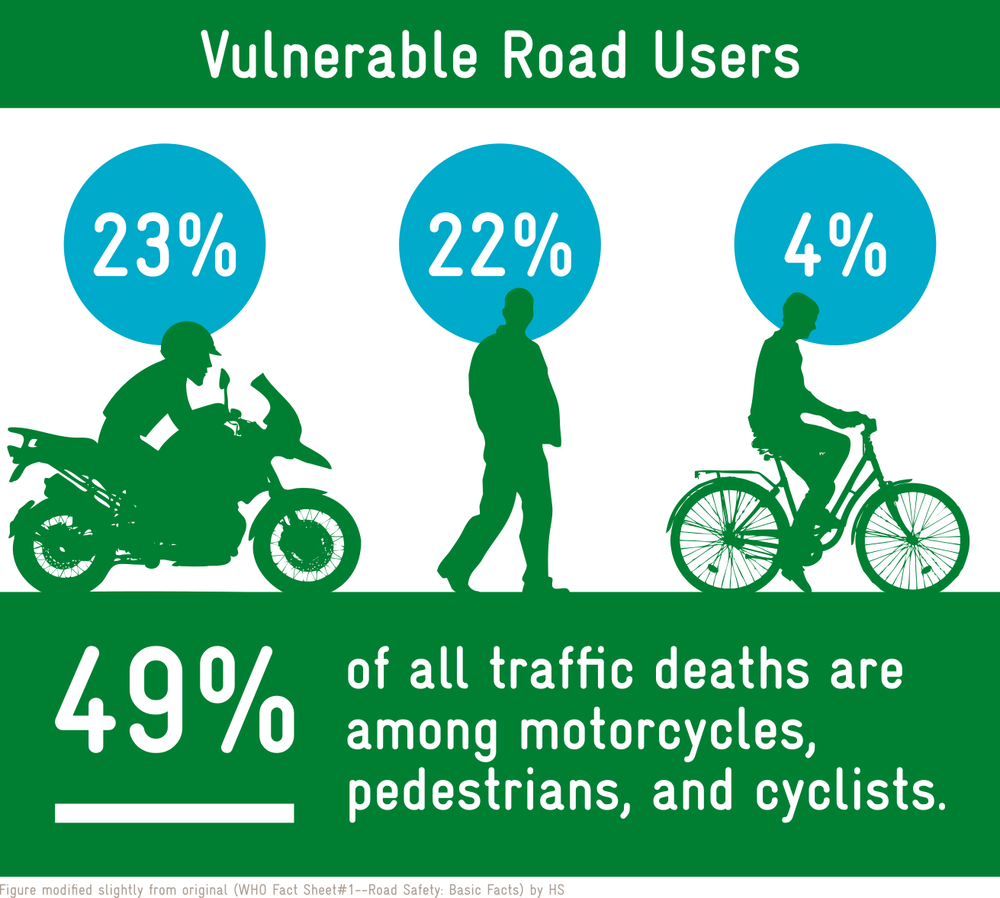
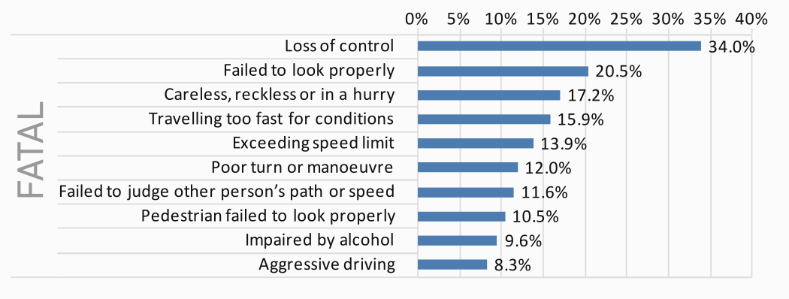
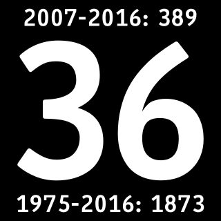
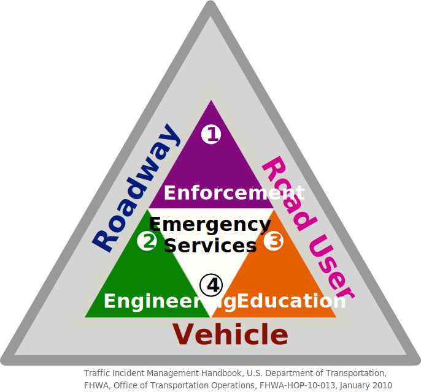
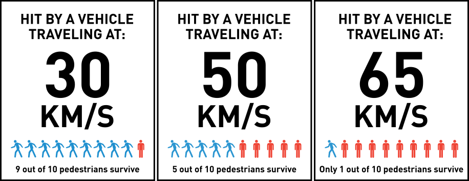
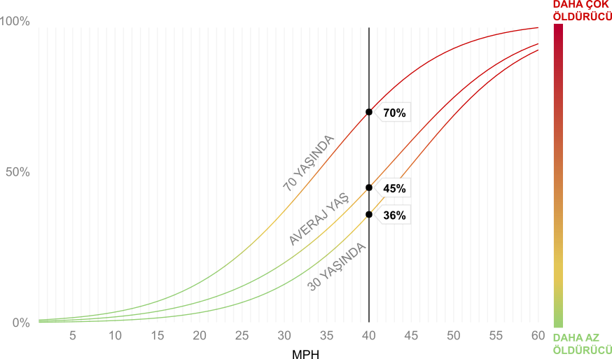

## [Basic Facts by WHO](http://www.who.int/violence_injury_prevention/publications/road_traffic/factsheet_1_web.pdf) (1/6)

- "About 1.25 million people globally die each year as a result of road traffic crashes—that’s over 3400 deaths a day."

- "Nearly half of those who die on the world’s roads are vulnerable road users: pedestrians, cyclists and motorcyclists."

- Ref: [WHO Fact Sheet#1--Road Safety: Basic Facts](http://www.who.int/violence_injury_prevention/publications/road_traffic/factsheet_1_web.pdf)

## [Basic Facts by WHO](http://www.who.int/violence_injury_prevention/publications/road_traffic/factsheet_1_web.pdf) (2/6)

<!--
- "Around the world, almost three times more men than women die from road traffic injuries."  
-->

- "Road traffic injuries are the leading cause of death globally among people aged 15–29 years."

- {style="width: 600px; vertical-align: middle;"}

## [Basic Facts by WHO](http://www.who.int/violence_injury_prevention/publications/road_traffic/factsheet_1_web.pdf) (3/6)

- "Five key risk factors in road traffic deaths and injuries are: drinking and
  driving, speeding and failing to use motorcycle helmets, seat-belts and child
  restraints."  

- "Over 90% of the world’s road traffic fatalities occur in low- and
  middle-income countries, even though these countries have only about _half_
  the world’s vehicles."  

## [Basic Facts by WHO](http://www.who.int/violence_injury_prevention/publications/road_traffic/factsheet_1_web.pdf) (4/6)

-  {style="height: 350px; vertical-align: middle;"}

- "Without action, annual road traffic deaths are predicted to become the
  seventh leading cause of death, by 2030."

## [Basic Facts by WHO](http://www.who.int/violence_injury_prevention/publications/road_traffic/factsheet_1_web.pdf) (5/6)

[{style="height: 500px; vertical-align: middle;"}](http://www.who.int/violence_injury_prevention/publications/road_traffic/factsheet_1_web.pdf) 

## [Basic Facts by WHO](http://www.who.int/violence_injury_prevention/publications/road_traffic/factsheet_1_web.pdf) (6/6)

- "Reducing road traffic deaths requires paying more attention to the needs of
  pedestrians, cyclists and motorcyclists, who have so far been largely
  neglected in transport and planning policies."

- "By putting in place measures to increase safe walking and cycling,
  governments can also reduce air pollution, greenhouse gas emissions and
  traffic and achieve better health resulting from more physical activity."

## "New" Ideas for City Planning

- ["Complete Streets"](https://smartgrowthamerica.org/program/national-complete-streets-coalition/what-are-complete-streets/)

- ["Living Streets"](https://www.pps.org/blog/a-new-manual-for-living-streets/)

- ["Walkable Cities"](http://www.npr.org/2012/11/17/165239291/what-makes-a-city-walkable-and-why-it-matters)

- Examples:

    - [Los Angeles County, CA, USA](http://www.modelstreetdesignmanual.com/)

    - [Broward Country, FL, USA](http://www.browardmpo.org/index.php/44-complete-streets-initiative)

## "Complete Streets"

- [Broward County, FL, USA, Complete Streets Initiative](http://www.browardmpo.org/index.php/44-complete-streets-initiative)

    - "The Broward Complete Streets Guidelines manual is based on complete
      streets principles that aim to design streets for people of all ages and
      physical abilities and accommodate all travel modes"

- Traffic engineering, landscape architecture, transportation
  engineering, city planning, etc.

- Traffic safety written all over ... 

## "Walkable Cities"

[Jeff Speck -- TED Talk: "Walkable Cities"](http://www.ted.com/talks/jeff_speck_the_walkable_city)

<iframe width="550" height="412" src="http://www.youtube.com/embed/Wai4ub90stQ" frameborder="0" allowfullscreen></iframe>

[https://www.youtube.com/watch?v=Wai4ub90stQ](https://www.youtube.com/watch?v=Wai4ub90stQ)

## ["Decade of Action"](http://www.who.int/roadsafety/decade_of_action/plan/en/) (1/2)

- By WHO, covers 2011–2020

- Identifies 5 “pillars” for intervention:

    1. Road safety management
    2. Safer roads and mobility
    3. Safer vehicles
    4. Safer road users
    5. Post-crash response

## ["Decade of Action"](http://www.who.int/roadsafety/decade_of_action/plan/en/) (2/2)

- "14 MARCH 2013 | GENEVA - Only 28 countries, covering 7% of the world’s
  population, have comprehensive road safety laws on all five key risk factors:
  drinking and driving, speeding, and failing to use motorcycle helmets,
  seat-belts, and child restraints."

    - 
[http://www.who.int/mediacentre/news/releases/2013/road_safety_20130314/en/](http://www.who.int/mediacentre/news/releases/2013/road_safety_20130314/en/)

   - [Global Status Report On Road Safety](http://apps.who.int/iris/bitstream/10665/83789/1/WHO_NMH_VIP_13.01_eng.pdf)
     -- 2013 -- Supporting A Decade Of Action

## Saving Lives and Eliminating Injuries

- "[The Association for the Advancement of Automotive Medicine
  (AAAM)](https://www.aaam.org/about/) is the premier global professional
  organization dedicated to saving lives and eliminating injuries associated
  with road traffic __crashes__. AAAM is a multi-disciplinary organization that
  promotes its mission through scientific research, authoritative educational
  programs, public policy recommendations, and pre-eminent Abbreviated Injury
  Scale (AIS) coding, training and certification."

    - [https://www.aaam.org/](https://www.aaam.org/)

## The Problem

- __CRASHES!!!__

    - Psychological losses

    - Physical losses (esp. death or permanent injury)

    - Economic losses

- Time lost and increased fuel consumption due to prolonged delay/wait times,
  environmental side-effects, stress, frustration, anger, etc. that result from
  from using the traffic system

## Societal Demand

TRAFFIC SAFETY

## Traffic Safety System Priority

SAVING LIVES 

and 

PREVENTING SERIOUS/PERMANENT INJURIES

## What is road traffic?

__Traffic__ is the movement of road users (mostly people, but animals
at times) and goods from one location to another on roadways via vehicular
(motorized/unmotorized) travel or on foot.

## What is an "accident"/crash?

"A traffic collision, also known as a motor vehicle collision (MVC) among
others, occurs when a vehicle collides with another vehicle, pedestrian,
animal, road debris, or other stationary obstruction, such as a tree or pole.
Traffic collisions may result in injury, death and property damage."

[https://en.wikipedia.org/wiki/Traffic_collision](https://en.wikipedia.org/wiki/Traffic_collision)

## What is road traffic safety?

"__Road traffic safety__ refers to the methods and measures used to prevent road
users from being killed or seriously injured. Typical road users include
pedestrians, cyclists, motorists, vehicle passengers, and passengers of on-road
public transport (mainly buses and trams)."

[https://en.wikipedia.org/wiki/Road_traffic_safety](https://en.wikipedia.org/wiki/Road_traffic_safety)

## What is road traffic engineering?

"__Traffic engineering__ is a branch of _civil engineering_ that uses engineering
techniques to achieve the __safe__ and __efficient__ movement of people and goods on
roadways. It focuses mainly on research for safe and efficient traffic flow,
such as road geometry, sidewalks and crosswalks, cycling infrastructure,
traffic signs, road surface markings and traffic lights. Traffic engineering
deals with the functional part of transportation system, except the
infrastructures provided."

[https://en.wikipedia.org/wiki/Traffic_engineering_(transportation)](https://en.wikipedia.org/wiki/Traffic_engineering_(transportation)) 

## What is road traffic engineering?

"__Traffic engineering__ ... deals with the planning, geometric design and
traffic operations of roads, streets and highways and their networks,
terminals, abutting lands and relationships with other modes of transportation
for the achievement of __safe__, __efficient__ and __convenient__ movement of
people and goods. __Traffic engineering__ applies engineering principles that help solve
transportation problems by considering the psychology and habits of the
transportation system users."

[https://www.azdot.gov/business/engineering-and-construction/traffic/faq](https://www.azdot.gov/business/engineering-and-construction/traffic/faq)

## {data-background="images/backgrounds/ertac-cuneyt-road.jpg"}

<!--
<object type="image/svg+xml" data="images/4es.svg"></object>
-->

{style="height: 550px;"}

## Causes of Vehicular Crashes (1/2)

1. Speeding while driving and reckless driving

1. Use of mobile phone 

1. Other forms of distracted driving 

1. Driver fatigue 

1. Drunk driving and driving while under the influence of a narcotic substance

[http://www.losangelespersonalinjurylawyers.co/top-10-causes-of-car-accidents](http://www.losangelespersonalinjurylawyers.co/top-10-causes-of-car-accidents/)

## Causes of Vehicular Crashes (2/2)

6. Rubber-necking 

1. Defective automobile and automobile parts 

1. Defects on roadway construction 

1. Poor weather conditions 

10. Improper coning off of construction zones 

[http://www.losangelespersonalinjurylawyers.co/top-10-causes-of-car-accidents](http://www.losangelespersonalinjurylawyers.co/top-10-causes-of-car-accidents/)

## Top 10 Factors (ALL)

[{class="logo"}](https://www.iamroadsmart.com/docs/default-source/research-reports/report_licensed-to-skill-v2.pdf)

[https://www.iamroadsmart.com/docs/default-source/research-reports/report_licensed-to-skill-v2.pdf](https://www.iamroadsmart.com/docs/default-source/research-reports/report_licensed-to-skill-v2.pdf)

## Top 10 Factors (FATAL)

[{class=""}](https://www.iamroadsmart.com/docs/default-source/research-reports/report_licensed-to-skill-v2.pdf)

[https://www.iamroadsmart.com/docs/default-source/research-reports/report_licensed-to-skill-v2.pdf](https://www.iamroadsmart.com/docs/default-source/research-reports/report_licensed-to-skill-v2.pdf)

## Top 10 Factors (SERIOUS)

[{class=""}](https://www.iamroadsmart.com/docs/default-source/research-reports/report_licensed-to-skill-v2.pdf)

[https://www.iamroadsmart.com/docs/default-source/research-reports/report_licensed-to-skill-v2.pdf](https://www.iamroadsmart.com/docs/default-source/research-reports/report_licensed-to-skill-v2.pdf)

## Top 10 Factors (SLIGHT)

[{class=""}](https://www.iamroadsmart.com/docs/default-source/research-reports/report_licensed-to-skill-v2.pdf)

[https://www.iamroadsmart.com/docs/default-source/research-reports/report_licensed-to-skill-v2.pdf](https://www.iamroadsmart.com/docs/default-source/research-reports/report_licensed-to-skill-v2.pdf)

## Summary of Crash Factors

| Factor                                  | FATAL | SERIOUS | SLIGHT | ALL   |
|-----------------------------------------|-------|---------|--------|-------|
| Driver/ Rider Error or Reaction         | 65.3% | 61.8%   | 68.6%  | 67.5% | 
| Injudicious Action                      | 31.4% | 25.0%   | 26.1%  | 26.0% | 
| Behavior or Inexperience                | 28.0% | 25.8%   | 24.4%  | 24.7% | 
| Road Environment                        | 10.9% | 13.3%   | 15.6%  | 15.1% | 
| Pedestrian only (casualty or uninjured) | 18.2% | 20.4%   | 11.5%  | 13.0% | 
| Impairment or Distraction               | 19.6% | 14.2%   | 11.1%  | 11.7% | 
| Vision Affected                         |  7.5% |  9.2%   | 10.5%  | 10.3% | 
| Special codes                           |  6.1% |  5.2%   |  4.5%  |  4.6% | 
| Vehicle Defects                         |  2.8% |  2.2%   |  1.9%  |  1.9% | 

<!--https://www.iamroadsmart.com/media-and-policy/research-and-policy/researches-list/evaluating-the-effectiveness-of-iam-driver-coaching-->

[https://www.iamroadsmart.com/docs/default-source/research-reports/report_licensed-to-skill-v2.pdf](https://www.iamroadsmart.com/docs/default-source/research-reports/report_licensed-to-skill-v2.pdf)

## {data-background="#161616"}

North Cyprus Traffic

<!--
## [Trafikte Ölümler](kktc-trafikte-olumler-1975-2016.html) (1975&ndash;2016){data-background="#161616"}
-->

## [Traffic Fatalities in North Cyprus](north-cyprus-traffic-fatalities-2000-2016.html) (2000&ndash;2016)

- Fatalities: 784, Serious injuries: > 3000

## 2016 Fatalities

{style="height: 500px;"}

## Fatalities as of 22 Mar 2017 

{style="height: 500px;"}

## Summary of Fatalities

Year Range       | Duration     | Total    | Average |
-----------------|--------------|----------|---------|
1975 &rarr; 2017 | 42+ years    | **1883** | &mdash; |
1975 &rarr; 2016 | 42 years     | 1873     | 44.6    |
1997 &rarr; 2016 | 20 years     |  914     | 45.7    |
2002 &rarr; 2016 | 15 years     |  671     | 44.7    |
2007 &rarr; 2016 | 10 years     |  389     | 38.9    |
2011 &rarr; 2016 | **6 years**  |  **208** | 34.7    |
1990 &rarr; 2016 | **27 years** | **1238** | 45.9    |

<!--

*NOT: 2016 yılını kapsayan veriler 14 Aralık 2016 gün sonu itibarı iledir.*

-->
                  
 
## Struggles of A Lone Engineer

<!--

Year Range       | Duration     | Total    | Average |
-----------------|--------------|----------|---------|
1990 &rarr; 2016 | **27 years** | **1238** | 45.9    |

-->

- Taner Aksu, a Turkish Cypriot

    - A licensed professional traffic engineer living in US

    - Started volunteering help to NC authorities in 1990

- **66**% of all fatalities as of March 22, 2017 happened _after_ 1990 (1248/1883) 

- **34**% of all fatalities occurred _before_ 1990 (635/1883) 

## [TRAKAYAD](www.trakayad.org)

- Second/younger traffic safety association in North Cyprus, established at the end of 2010

- Official member of "Traffic Commission"

- Advocates scientific and ethical principles based on Vision Zero 
  
- Defines problems and proposes solutions, provides constructive criticism 

- Since 2010, more than 200 people died in traffic

- **NO CHANGE!!!** ☹

<!--
- **NO CHANGE!!!** ☹
-->

## Fatalities per 100,000 population

Country                 | 2013                                    | 2012                                  | Population
------------------------|-----------------------------------------|---------------------------------------|--------------
**North Cyprus**        | [**16.3**](notes.html) (recent highest) | [**8.0**](notes.html) (recent lowest) | 300,000 (?) 
Sweden                  | [2.8](notes.html)                       | [3.1](notes.html)                     | 9.5M
United Kingdom          | [2.9](notes.html)                       | [2.8](notes.html)                     | 62M
Malta                   | [4.1](notes.html)                       | [2.2](notes.html)                     | 418,000
Germany                 | [4.1](notes.html)                       | [4.4](notes.html)                     | 82M
Iceland                 | [4.7](notes.html)                       | [2.8](notes.html)                     | 320,000
South Cyprus (RoC)      | [5.1](notes.html)                       | [5.9](notes.html)                     | 865,000
European Union          | [5.2](notes.html)                       | [5.5](notes.html)                     | 503M

## [Comparison of Fatalities](traffic-fatality-comparison-2001-2016.html) (2001&ndash;2016)

## ["Vision Zero, Sweden, 1997"](http://www.visionzeroinitiative.com/) (1/2)

- "The Vision Zero is the Swedish approach to road safety thinking. It can be
  summarized in one sentence:  No loss
  of life is acceptable. The Vision Zero approach has proven highly
  successful. It is based on the simple fact that we are human and make
  mistakes. The road system needs to keep us moving. But it must also be
  designed to protect us at every turn."

- [http://www.visionzeroinitiative.com](http://www.visionzeroinitiative.com)

## ["Vision Zero, Sweden, 1997"](http://www.visionzeroinitiative.com/) (2/2)

- __DEATH__ and __PERMANENT INJURY__ are ethically unacceptable

- __Shared__ responsibility for traffic safety 

    - __PUBLIC__: responsible

    - __SYSTEM__: **MORE** responsible

- __Political Leadership__

## Scientific Solution Formula: 4E

{class="drawing"}

[http://ops.fhwa.dot.gov/.../timhandbook/tim_handbook.pdf](http://ops.fhwa.dot.gov/eto_tim_pse/publications/timhandbook/tim_handbook.pdf)

## What is "Vision Zero?"

<iframe width="640" height="480" src="http://www.youtube.com/embed/EkcAZQOzJV0" frameborder="0" allowfullscreen></iframe>

[https://www.youtube.com/watch?v=EkcAZQOzJV0](https://www.youtube.com/watch?v=EkcAZQOzJV0)

## Solutions--EDUCATION

- Family/caregiver, kindergarten education

- Formal traffic safety education: 
    - preschool **&#10141;** high school + university
    - continuous, interactive, age/environment oriented

- Driver education

- Traffic safety awareness education of the public

- Traffic safety awareness education of professionals

- . . .

## Solutions--ENFORCEMENT

- Police enforcement system

- Driver licensing system

- Motor vehicle insurance system

- Vehicle inspection system

- Construction auditing system

- . . .

## Solutions--ENGINEERING

- Road/civil engineering

- Mechanical engineering

- . . .

- __TRAFFIC ENGINEERING__

## Solutions--EMERGENCY SERVICES

- Qualified doctors and EMTs in trauma treatment

- Tasks ([Handbook of Traffic Psychology ](http://www.sciencedirect.com/science/book/9780123819840))

    - Ability to reach the crash site quickly  
    
    - Treat patients as much as possible at crash site
    
    - Take patients to a trauma center as quickly as possible 

## State Authorities in Traffic

- Ministry of Transport (umbrella organization) 

    - "Traffic Administration"

    - "Traffic and Transportation Services Commission" 

- Ministry of Interior

    - Police

- Ministry of Education / Health / Finance

## Traffic Safety Policy in North Cyprus

- No known written policy

- No vision, written or official

- No foresight

- Parliament rarely mentions traffic safety

- No scientific and ethical approach

## Traffic Safety in Government Programs (1/2)

- Current government program (2016): 

    - Bicycle roads, fixing of uncontrolled junctions on main roads,
      illumination of all main roads, reorganization of the education system
      (but no direct mention of traffic safety education)

    - 
[http://www.havadiskibris.com/iste-hukumet-programindan-detaylar/ (TR)](http://www.havadiskibris.com/iste-hukumet-programindan-detaylar/)

## Traffic Safety in Government Programs (2/2)

- Previous government program (2013):

    - Traffic (safety) education from primary school (!) to high school to be
      integrated into all curricula, determination and rehabilitation of high
      crash sites, turning vehicle inspection to private sector, formation of
      Traffic Services Administration, etc. 

    - 
[http://www.gazete360.com/hukumet-programi-tam-metin/ (TR)](http://www.gazete360.com/hukumet-programi-tam-metin/)

## European Union Influence (1/2)

- Traffic Safety Projects for Turkish Cypriot Community (2009-2010)

    - Accident Black Spots Project
   
    - Accident Information System (AIS)
   
    - Driving Licenses
   
    - Primary Road Network
   
    - Traffic Operations
   
    - Vehicle Inspection Center

## European Union Influence (1/2)

- Slow adjustment of TRNC laws to European Union laws

- New seat belt/child restraint law (2012)

- New regulations underway

    - Driving schools, driver licenses/health, traffic laws, vehicle categorizations,
      etc.

<!--
Sürüş Eğitim İzni ve Sürüş Ehliyetleri Sağlık Tüzüğü

Ehliyet, Sınav ve Sürüş Ehliyet Müfettişleri ile ilgili Usul ve Kurallar Tüzüğü

Şoför Okulları ve Eğitmenleri ile İlgili Esas ve Kıstasları Düzenleme Tüzüğü

1974 Motorlu Araçlar ve Yol Trafik Tüzüğü
-->

## Approach to Traffic Safety in NC (1/4)

- EDUCATION

    - No formal traffic safety education in schools
    - Driver education is archaic
    - No serious traffic safety awareness campaigns 
    - No traffic safety awareness for professionals

## Approach to Traffic Safety in NC (2/4)

- ENFORCEMENT

    - No enforcement system that exist seems to serve the public
    - Only hope in the short term is a **modern** police enforcement

## Approach to Traffic Safety in NC (3/4)

- ENGINEERING

    - No traffic engineering
    - Mechanical engineers are not consulted

## Approach to Traffic Safety in NC (3/4)

- EMERGENCY SERVICES

    - Recently a much better emergency service was set up
    - No other systems in place to enable faster trips
    - Increasing traffic crash awareness
    - Lack of qualified staff (doctors, EMTs)

## Why are we unsuccessful?

- VISION

- MISSIONS

- GOALS

- __CHANGE__

## {data-background="#060"}

SOLUTION

TRAFFIC SAFETY CRISIS CENTER

## Traffic Safety Crisis Center

- Ad-hoc committee to be set up by the Parliament

- An expert advisory committee 

## Parliamentary Traffic Safety Investigation Committee

- Question the responsible officials and government

- Investigate real reasons for fatalities

- Demonstrate political leadership to establish a lasting Traffic Safety System

## Traffic Safety Advisory Committee

- Made up of traffic safety experts

- Advise the Parliamentary Ad-hoc Committee

- Oversee all traffic safety planning

- Establish a traffic safety system

## Work Principles of Crisis Center

- will work based on scientific principles

- will adhere to ethical standards

- will be transparent to public/media 

- will continually inform the public/media

## Duration of Crisis Center

- will remain in place until a traffic safety system that is in service of the
  public is put in place

- will not work as a seasonal body but until this ultimate goal is reached (several years at the minimum) 

## Conclusions

- We use traffic every day of our lives

- Everyone deserves traffic safety: __4E__ = EDUCATION + ENFORCEMENT + ENGINEERING + EMERGENCY SERVICES **&#10141;** Traffic Safety System

- Lives can be saved and permanent injuries can be eliminated if we work based on __SCIENTIFIC__ and __ETHICAL__ principles

- __CHANGE__ is an unavoidable must!

## {data-background="#acf"}

Thanks 😃

{style="height: 300px;"}

## Bibliography

- 
[http://www.who.int/violence_injury_prevention/publications/road_traffic/factsheet_1_web.pdf](http://www.who.int/violence_injury_prevention/publications/road_traffic/factsheet_1_web.pdf)

- 
[http://www.who.int/roadsafety/decade_of_action/plan/en/](http://www.who.int/roadsafety/decade_of_action/plan/en/)

[https://smartgrowthamerica.org/tag/complete-streets-basic-resources/](https://smartgrowthamerica.org/tag/complete-streets-basic-resources/)

- 
[http://www.devplan.org/ISTYILLIK/IST-YILLIK-2015.pdf](http://www.devplan.org/ISTYILLIK/IST-YILLIK-2015.pdf)

- 
[http://la.streetsblog.org/wp-content/uploads/sites/2/2012/06/livingsts_casestdy_FINAL_8.5x11.pdf](http://la.streetsblog.org/wp-content/uploads/sites/2/2012/06/livingsts_casestdy_FINAL_8.5x11.pdf)

- 
[Handbook of Traffic Psychology ](http://www.sciencedirect.com/science/book/9780123819840)

<!--

## Traffic Safety Law (2/2) 

- 

- [AAAM](https://www.aaam.org/): Only 7% of the world population has
  adequate laws for traffic safety

- Even in the US, more than 35,000 people died due to traffic crashes in 2015,
  a 7.2% increase from previous year

## Credits

- Modified slightly from original by HS

## SPEED and PEDESTRIANS (1/2)

[http://visionzeronetwork.org/resources/speed-fatality-map/](http://visionzeronetwork.org/resources/speed-fatality-map/)

## SPEED and PEDESTRIANS

[{class="logo"}](https://www.propublica.org/article/unsafe-at-many-speeds)

[https://www.propublica.org/article/unsafe-at-many-speeds](https://www.propublica.org/article/unsafe-at-many-speeds)

- __4E__ = EDUCATION + ENFORCEMENT + ENGINEERING + EMERGENCY SERVICES **&#10141;** Traffic Safety System

[{class="logo"}](http://www.visionzeroinitiative.com) 

-->

