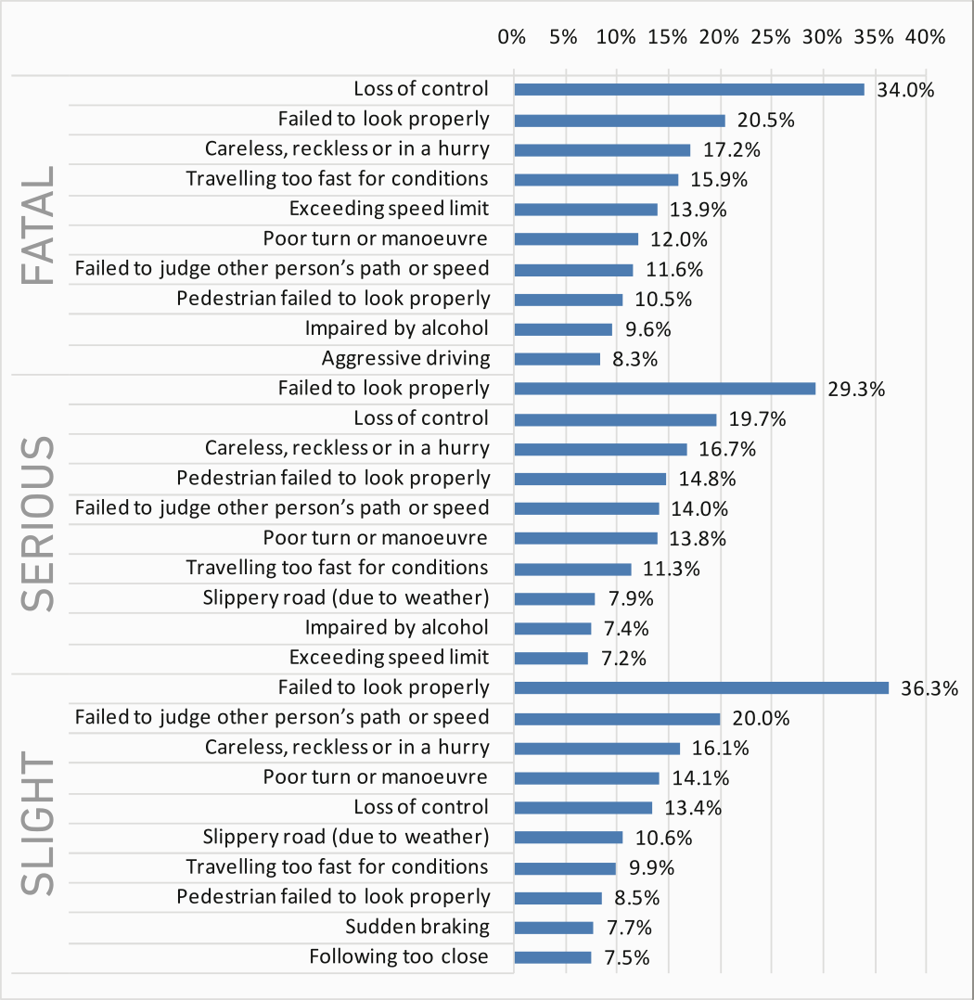

## Overview

- Evidence-based __problem definition__

- How does the rest of the world do it?

- Where does TRNC stand?

- What should TRNC be doing?

- Policies / vision / mission / goals

- CHANGE

## Responsibilites of the State

- Work SCIENTIFICALLY with ETHICAL PRINCIPLES

- Hold paramount the SAFETY, HEALTH, and WELFARE of the PUBLIC
   
    - Codes of Engineering Ethics

- Emphasis on a good EDUCATION System

## {data-background="images/backgrounds/ertac-cuneyt-road.jpg"}

<!--
<object type="image/svg+xml" data="images/4es.svg"></object>
-->

{style="height: 550px;"}

## Societal Demand

TRAFFIC SAFETY

## Goal of Traffic Safety

SAVING LIVES 

and 

PREVENTING SERIOUS/PERMANENT INJURIES

## What is an "accident"/crash?

"A traffic collision, also known as a motor vehicle collision (MVC) among
others, occurs when a vehicle collides with another vehicle, pedestrian,
animal, road debris, or other stationary obstruction, such as a tree or pole.
Traffic collisions may result in injury, death and property damage."

[https://en.wikipedia.org/wiki/Traffic_collision](https://en.wikipedia.org/wiki/Traffic_collision)

## Causes of Vehicular Crashes (1/2)

1. Speeding while driving and reckless driving

2. Use of mobile phone 

3. Other forms of distracted driving 

4. Driver fatigue 

5. Drunk driving and driving while under the influence of a narcotic substance

[http://www.losangelespersonalinjurylawyers.co/top-10-causes-of-car-accidents/](http://www.losangelespersonalinjurylawyers.co/top-10-causes-of-car-accidents/)

## Causes of Vehicular Crashes (2/2)

6. Rubber-necking 

7. Defective automobile and automobile parts 

8. Defects on roadway construction 

9. Poor weather conditions 

10. Improper coning off of construction zones 

[http://www.losangelespersonalinjurylawyers.co/top-10-causes-of-car-accidents/](http://www.losangelespersonalinjurylawyers.co/top-10-causes-of-car-accidents/)

## Top 10 crash factors (ALL)

[{class="logo"}](https://www.iamroadsmart.com/docs/default-source/research-reports/report_licensed-to-skill-v2.pdf)

[https://www.iamroadsmart.com/docs/default-source/research-reports/report_licensed-to-skill-v2.pdf](https://www.iamroadsmart.com/docs/default-source/research-reports/report_licensed-to-skill-v2.pdf)

## Top 10 crash factors (FATAL)

[{class=""}](https://www.iamroadsmart.com/docs/default-source/research-reports/report_licensed-to-skill-v2.pdf)

[https://www.iamroadsmart.com/docs/default-source/research-reports/report_licensed-to-skill-v2.pdf](https://www.iamroadsmart.com/docs/default-source/research-reports/report_licensed-to-skill-v2.pdf)

## Top 10 crash factors (SERIOUS)

[{class=""}](https://www.iamroadsmart.com/docs/default-source/research-reports/report_licensed-to-skill-v2.pdf)

[https://www.iamroadsmart.com/docs/default-source/research-reports/report_licensed-to-skill-v2.pdf](https://www.iamroadsmart.com/docs/default-source/research-reports/report_licensed-to-skill-v2.pdf)

## Top 10 crash factors (SLIGHT)

[{class=""}](https://www.iamroadsmart.com/docs/default-source/research-reports/report_licensed-to-skill-v2.pdf)

[https://www.iamroadsmart.com/docs/default-source/research-reports/report_licensed-to-skill-v2.pdf](https://www.iamroadsmart.com/docs/default-source/research-reports/report_licensed-to-skill-v2.pdf)

## Looking deeper: Why do crashes happen?

- 65% of fatal crashes: "Driver error or reaction"

    - "Sorry mate, I didn't see you"

    - "Loss of control" (endemic reason frequently cited by TC police) 

    - "Poor turn or manoeuvre"

    - Failure "to judge other person's path or speed" 

- 31% of fatal crashes: Speed: "going too fast for the conditions"

- Driving under the influence

- Careless driving

- Dağınık/yorgun olma 

- . . .

## What is road traffic?

__Traffic__ is the movement of road users (mostly people, but animals
at times) and goods from one location to another on roadways via vehicular
(motorized/unmotorized) travel or on foot.

## What is road traffic safety?

"__Road traffic safety__ refers to the methods and measures used to prevent road
users from being killed or seriously injured. Typical road users include
pedestrians, cyclists, motorists, vehicle passengers, and passengers of on-road
public transport (mainly buses and trams)."

[https://en.wikipedia.org/wiki/Road_traffic_safety](https://en.wikipedia.org/wiki/Road_traffic_safety)

## What is road traffic engineering?

"__Traffic engineering__ is a branch of _civil engineering_ that uses engineering
techniques to achieve the __safe__ and __efficient__ movement of people and goods on
roadways. It focuses mainly on research for safe and efficient traffic flow,
such as road geometry, sidewalks and crosswalks, cycling infrastructure,
traffic signs, road surface markings and traffic lights. Traffic engineering
deals with the functional part of transportation system, except the
infrastructures provided."

[https://en.wikipedia.org/wiki/Traffic_engineering_(transportation)](https://en.wikipedia.org/wiki/Traffic_engineering_(transportation)) 

## What is road traffic engineering?

"__Traffic engineering__ is that phase of engineering that deals with the planning,
geometric design and traffic operations of roads, streets and highways and
their networks, terminals, abutting lands and relationships with other modes of
transportation for the achievement of safe, efficient and convenient movement
of people and goods.

__Traffic engineering__ applies engineering principles that help solve
transportation problems by considering the psychology and habits of the
transportation system users."

[https://www.azdot.gov/business/engineering-and-construction/traffic/faq](https://www.azdot.gov/business/engineering-and-construction/traffic/faq)

## "DİREKSİYON HAKİMİYETİ"

- "'Direksiyon hakimiyeti' kayıtsız şartsız SİSTEMİNDİR."

- Direksiyon hakimiyetini kaybeden KİMDİR?

## {data-background="#161616"}

KKTC Trafiği

<!--
## [Trafikte Ölümler](kktc-trafikte-olumler-1975-2016.html) (1975&ndash;2016){data-background="#161616"}
-->

## [Trafikte Ölümler](kktc-trafikte-olumler-2000-2016.html) (2000&ndash;2016)

- Ölümler: 784, ciddi yaralanmalar: > 3000

## 2016

{style="height: 500px;"}

## 8 Şubat 2017 

{style="height: 500px;"}

## Kayıplarımız 

Yıl Aralığı      | Periyot    | Toplam   | Averaj  |
-----------------|------------|----------|---------|
1975 &rarr; 2017 | 43 yıl     | **1875** | &mdash; |
1975 &rarr; 2016 | 42 yıl     | 1873     | 44.6    |
1997 &rarr; 2016 | 20 yıl     |  914     | 45.7    |
2002 &rarr; 2016 | 15 yıl     |  671     | 44.7    |
2007 &rarr; 2016 | 10 yıl     |  389     | 38.9    |
2011 &rarr; 2016 | **6 yıl**  |  **208** | 34.7    |
1990 &rarr; 2016 | **27 yıl** | **1238** | 45.9    |

<!--

*NOT: 2016 yılını kapsayan veriler 14 Aralık 2016 gün sonu itibarı iledir.*

-->
                  
 
## Taner AKSU'nun Çabaları

Yıl Aralığı      | Periyot    | Toplam   | Averaj  |
-----------------|------------|----------|---------|
1990 &rarr; 2016 | **27 yıl** | **1238** | 45.9    |

- Başlangıç: 1990 yılı

- 1 Şubat, 2017 itibarı ile toplam 1840 ölüm

- Toplam ölümlerin **%66'sı** (1240) Taner Aksu'nun çabalarının başladığı yıldan **SONRA**
  gerçekleşti

- Toplam ölümlerin **%34'ü** (635) Taner Aksu'nun çabalarının başladığı yıldan **ÖNCE** gerçekleşti

## 100,000 nüfusa ölüm oranları

Ülke                    | 2013                | 2012               | Nüfus
------------------------|---------------------|--------------------|------------
**KKTC**                | [**16.3**](notlar.html) | [**8.0**](notlar.html) | 300,000
Güney Kıbrıs            | [5.1](notlar.html)  | [5.9](notlar.html) | 865,000
İzlanda                 | [4.7](notlar.html)  | [2.8](notlar.html) | 320,000
Malta                   | [4.1](notlar.html)  | [2.2](notlar.html) | 418,000
Almanya                 | [4.1](notlar.html)  | [4.4](notlar.html) | 82 milyon
Birleşik Krallık        | [2.9](notlar.html)  | [2.8](notlar.html) | 62 milyon
İsveç                   | [2.8](notlar.html)  | [3.1](notlar.html) | 9.5 milyon
Avrupa Birliği          | [5.2](notlar.html)  | [5.5](notlar.html) | 503 milyon

## Trafikte Ölümler (2001&ndash;2016)

## HIZ ve YAYALAR (1/2)

[{class="logo"}](http://visionzeronetwork.org/resources/speed-fatality-map/)

[http://visionzeronetwork.org/resources/speed-fatality-map/](http://visionzeronetwork.org/resources/speed-fatality-map/)

## HIZ ve YAYALAR (2/2)

[{class="logo"}](https://www.propublica.org/article/unsafe-at-many-speeds)

[https://www.propublica.org/article/unsafe-at-many-speeds](https://www.propublica.org/article/unsafe-at-many-speeds)

## "Vizyon Sıfır" (İsveç, 1997)

[{class="logo"}](http://www.visionzeroinitiative.com) 

[http://www.visionzeroinitiative.com](http://www.visionzeroinitiative.com) 

## Çağdaş Çözüm Formülü: 4E

{class="drawing"}

[http://ops.fhwa.dot.gov/.../timhandbook/tim_handbook.pdf](http://ops.fhwa.dot.gov/eto_tim_pse/publications/timhandbook/tim_handbook.pdf)

## Trafik Güvenliği Vizyonu: ["Vizyon Sıfır"](http://www.visionzeroinitiative.com/)

- __ÖLÜM__ ve __KALICI SAKATLIK__ kabul edilemezdir

- Trafik güvenliği sorumlulğu __paylaşılmalıdır__ 

    - Toplum: **Sorumlu**

    - Sistem (Yetkililer/Uygulayıcılar): __Daha sorumlu__

- EĞİTİM + DENETİM + MÜHENDİSLİK + ACİL HİZMETLER

- __4E__ **&#10141;** Trafik Güvenliği Sistemi 

- __Liderlik__

## Trafik Güvenliği Çözümleri--EĞİTİM

- Aile, kreş eğitimi

- Okullardaki *örgün* trafik güvenliği eğitimi
    - anasınıf **&#10141;** lise son sınıf + üniversite
    - sürekli, interaktif, yaşa/yaşam şartlarına uygun

- Sürücü eğitimi

- Toplumun trafik güvenliği farkındalık eğitimi

- Mesleki trafik güvenliği farkındalık eğitimi

- . . .

## Trafik Güvenliği Çözümleri--DENETİM

- Polis denetimleri

- Ehliyet sistemi

- Araç sigorta sistemi

- Araç muayeneleri

- Yapısal denetim

- . . .

## Trafik Güvenliği Çözümleri--MÜHENDİSLİK

- Yol/İnşaat mühendisliği

- Makina mühendisliği

- . . .

- __TRAFİK MÜHENDİSLİĞİ__

## KKTC Trafik Mercileri

- Ulaştırma Bakanlığı (şemsiye kurum)

   - "Trafik Dairesi"

   - "Trafik ve Ulaştırma Hizmetleri Komisyonu"

   - İzin Kurulu, vb

- İçişleri Bakanlığı

   - Polis

- Eğitim Bakanlığı

## KKTC'deki Trafik Güvenliği Yaklaşımı (1/3)

- EĞİTİM

    - Örgün Trafik Güvenliği Eğitimi yoktur
    - Sürücü eğitimi çağın gerisindedir
    - Toplumsal farkındalık eğitimi yoktur
    - Mesleki farkındalık eğitimi yoktur

## KKTC'deki Trafik Güvenliği Yaklaşımı (2/3)

- DENETİM

    - Hiçbir denetim sistemi hizmet vermemektedir
    - Kısa vadede tek ümit **çağdaş** polis denetimidir

## KKTC'deki Trafik Güvenliği Yaklaşımı (3/3)

- MÜHENDİSLİK

    - TRAFİK MÜHENDİSLİĞİ yoktur
    - Makina mühendislerinden faydalanılmamaktadır

## Neden hala başarısızız?

- VİZYON

- MİSYON

- AMAÇLAR

- __DEĞİŞİM__

## {data-background="#060"}

ÇÖZÜM

TRAFİK GÜVENLİĞİ KRİZ MASASI

## Trafik Güvenliği Kriz Masası 

- Meclis Ad Hoc Soruşturma Komitesi

- Trafik Güvenliği Uzman Kurulu

## Meclis Ad Hoc Soruşturma Komitesi

- Hükümeti, sorumluları sorgulayacak

- Ölümlerin nedenlerini araştıracak

- Politik liderlik ortaya koyacak

## Trafik Güvenliği Uzman Kurulu

- Ad Hoc komiteye danışmanlık yapacak

- Tüm trafik güvenliği planlamasını yönetecek

- Trafik Güvenliği Sistemi oluşturacak

## TG Kriz  Masası Çalışma Biçimi

- Bilimsel çalışacak

- Etik standartlara uyacak

- Şeffaf olacak

- Toplumu/basını sürekli bilgilendirecek

## TG Kriz  Masası Görev Süresi

- Topluma trafik güvenliği hizmetleri ulaşana dek, yani amaca hizmet edecek
  düzeyde bir Trafik Güvenliği
  Sistemi oluşturulana dek görevde kalacak 

## Örnek (1) &ndash; Cep Telefonu

<iframe width="640" height="480" src="

http://www.youtube.com/embed/Ss021L0hWU4" frameborder="0" allowfullscreen></iframe>

[https://www.youtube.com/watch?v=Ss021L0hWU4](https://www.youtube.com/watch?v=Ss021L0hWU4)

## Örnek (2) &ndash; Cep Telefonu

<iframe width="640" height="480" src="

http://www.youtube.com/embed/l7ljxDjwDjU" frameborder="0" allowfullscreen></iframe>

[https://www.youtube.com/watch?v=l7ljxDjwDjU](https://www.youtube.com/watch?v=l7ljxDjwDjU)

## Örnek (3) &ndash; Emniyet Kemeri

<iframe width="640" height="480" src="

http://www.youtube.com/embed/L62ueMB0E5E" frameborder="0" allowfullscreen></iframe>

[https://www.youtube.com/watch?v=L62ueMB0E5E](https://www.youtube.com/watch?v=L62ueMB0E5E)

## Örnek (4) &ndash; Emniyet Kemeri

<iframe width="640" height="480" src="

http://www.youtube.com/embed/Sg5i9YInU64" frameborder="0" allowfullscreen></iframe>

[https://www.youtube.com/watch?v=Sg5i9YInU64](https://www.youtube.com/watch?v=Sg5i9YInU64)

## Örnek (5) &ndash; Emniyet Kemeri

<iframe width="640" height="480" src="

http://www.youtube.com/embed/K6tsgzFvVI0" frameborder="0" allowfullscreen></iframe>

[https://www.youtube.com/watch?v=K6tsgzFvVI0](https://www.youtube.com/watch?v=K6tsgzFvVI0)

## Örnek (6) &ndash; Emniyet Kemeri

<iframe width="640" height="480" src="

http://www.youtube.com/embed/DEzXz4G3HS8" frameborder="0" allowfullscreen></iframe>

[https://www.youtube.com/watch?v=DEzXz4G3HS8](https://www.youtube.com/watch?v=DEzXz4G3HS8)

## Örnek (7) &ndash; Emniyet Kemeri

<iframe width="640" height="480" src="

http://www.youtube.com/embed/fzbCeVQqrxA" frameborder="0" allowfullscreen></iframe>

[https://www.youtube.com/watch?v=fzbCeVQqrxA](https://www.youtube.com/watch?v=fzbCeVQqrxA)

## Örnek (8) &ndash; Emniyet Kemeri

<iframe width="640" height="480" src="

http://www.youtube.com/embed/n7ICjWJivec" frameborder="0" allowfullscreen></iframe>

[https://www.youtube.com/watch?v=n7ICjWJivec](https://www.youtube.com/watch?v=n7ICjWJivec)

## Örnek (9) &ndash; Emniyet Kemeri

<iframe width="640" height="480" src="

http://www.youtube.com/embed/db69Ot2Tlo8" frameborder="0" allowfullscreen></iframe>

[https://www.youtube.com/watch?v=db69Ot2Tlo8](https://www.youtube.com/watch?v=db69Ot2Tlo8)

## Örnek (10) &ndash; Çarpışma Testi

<iframe width="640" height="480" src="

http://www.youtube.com/embed/xk1QNW2Hr_U" frameborder="0" allowfullscreen></iframe>

[https://www.youtube.com/watch?v=xk1QNW2Hr_U](https://www.youtube.com/watch?v=xk1QNW2Hr_U)

## Örnek (11) &ndash; Çarpışma Testi

<iframe width="640" height="480" src="

http://www.youtube.com/embed/HclxgVmpTjI" frameborder="0" allowfullscreen></iframe>

[https://www.youtube.com/watch?v=HclxgVmpTjI](https://www.youtube.com/watch?v=HclxgVmpTjI)

## Örnek (12) &ndash; Çarpışma Testi

<iframe width="640" height="480" src="

http://www.youtube.com/embed/93B_ymBb7ds" frameborder="0" allowfullscreen></iframe>

[https://www.youtube.com/watch?v=93B_ymBb7ds](https://www.youtube.com/watch?v=93B_ymBb7ds)

## Örnek (13) &ndash; Çarpışma Testi

<iframe width="640" height="480" src="

http://www.youtube.com/embed/bXD9VmbOLKA" frameborder="0" allowfullscreen></iframe>

[https://www.youtube.com/watch?v=bXD9VmbOLKA](https://www.youtube.com/watch?v=bXD9VmbOLKA)

## Örnek (14) &ndash; Çarpışma Testi

<iframe width="640" height="480" src="

http://www.youtube.com/embed/R7dG9UlzeFM" frameborder="0" allowfullscreen></iframe>

[https://www.youtube.com/watch?v=R7dG9UlzeFM](https://www.youtube.com/watch?v=R7dG9UlzeFM)

## SONUÇ

- Trafiği tüm hayatımız boyunca kullanırız

- Trafik Güvenliği için __EĞİTİM__, __DENETİM__, __MÜHENDİSLİK__, __ACİL HİZMETLER__ her bireyin hakkıdır

- Doğruları yaparken başkalarının da doğruları yapmasını talep etmek bir insanlık hakkıdır 

- Trafikte ölüm ve kalıcı sakatlık __BİLİMSEL__ ve __ETİK__ temellerde çalışılarak önlenebilir

- Trafikte __DEĞİŞİM__ şarttır.

## {data-background="#bbbbb"}

Teşekkürler :)

{style="height: 300px;"}

