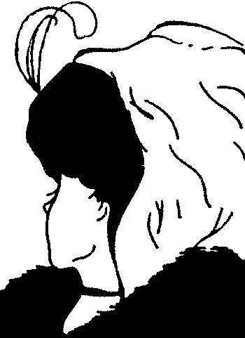
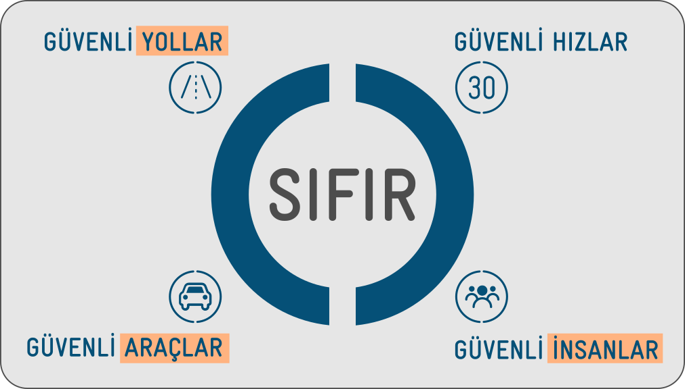
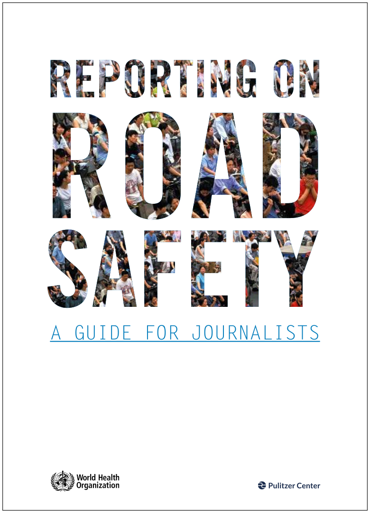

<!--
How to change

law
engineering
new department of traffic
-->

## Özet <!--{data-background-image="images/asphalt04.jpg" class="whitefonts"}-->

- KKTC'nin trafik güvenliği krizi

- Komitenin oluşumu

- Komitenin yapısı, çalışma biçimi 

- Komitenin vizyonu

- Komitenin amaçları

- Basının rolü

- Sonuç

## Trafik güvenliğini düşündüğümüzde ne anlıyoruz? {data-transition="none"}

## Trafik güvenliğini düşündüğümüzde ne anlıyoruz?

{class="drawing"}

## Bazı tanımlar (1/2)

- "__Trafik__" nedir?

    - İnsanların ve ihtiyaç maddelerinin bir yerden başka bir yere güvenli ve
      verimli şekilde ulaşımını sağlayan sistem

- "__Trafik güvenliği__" nedir?

    - Yol kullananların trafikte ölmemesi ve ciddi şekilde yaralanmaması için
      kullanılan metodlar ve alınan önlemler bütünü

## Bazı tanımlar (2/2)

- "__Trafik mühendisliği__" nedir?

    - Yol kullananların güvenli, verimli, ve akıcı bir şekilde seyahat etmesini
      sağlayan mühendislik alanı 

## Trafikte Öncelikler

[{class="logo"}]()

## {data-background-image="images/ertac-cuneyt-once-guvenlik.png"}

## KKTC'nin Trafik Güvenliği Krizi <!--{data-background-image="images/asphalt04.jpg" class="whitefonts"}-->

- Topluma hizmet veren bir trafik güvenliği sisteminin olmamasından kaynaklanan
  çok sayıda ölüm ve ciddi yaralanma ([MAIS3+](http://www.ictct.org/wp-content/uploads/Nuyttens.pdf))/kalıcı sakatlık

    - Maddi, fiziksel, ve ruhsal kayıplar

- Yıllardan beridir gereken çözümleri üretecek bir trafik güvenliği sisteminin
  olmamasından doğan eksiklikler

## Trafik Güvenliği Komitesi (TGK)

- 4 Mayıs 2017: "Trafik güvenliği" gündemi ile ilk kez olağanüstü statüde
  gerçekleştirilen KKTC Cumhuriyet Meclisi birleşimi

- TGK'nin oybirliği ile kurulması

- Uzman takımın görevlendirilmesi

- Şeffaflık, hesap verebilirlik

- Takım ruhu ile çalışmak

<!--
## {data-background-image="images/tgk.png"}
-->

##

## Vizyon

KKTC'de topluma hizmet verecek—_trafikte hayat kurtaracak ve ciddi
yaralanmaları önleyecek_—bir __Trafik Güvenliği Sistemi__ oluşturulmasını
sağlamak

## TGK Yapısı

- Toplam 7 milletvekili

- Alt çalışma grubu

    - Görev alan 7 milletvekili arasından seçilen 4 milletvekili

    - 3 kişilik uzman takımı

## Milletvekillerin görevleri (1/2)

- Uzman takıma türlü hususta destek ve yardımcı olmak

- Trafik güvenliği ile ilgili kurum, kuruluş, ve örgütler ile yapılacak istişarelere katkı koymak 

- Uzman takımın ilgili birimlerin yardımlarıyla hazırlayacağı raporları değerlendirmek

## Milletvekillerin görevleri (2/2)

- Amaca hizmet edecek bir trafik güvenliği sisteminin yürütme organları tarafından uygulamaya konulması için köprü görevi görmek

- Amaca yönelik yasa çalışmaları yapmak

- Uzman takımla birlikte KKTC’de topluma hizmet edecek bir trafik güvenliği sistemi tesis edilene kadar görevde kalmak

## Uzman Takımı

- Profesyonel lisanslı trafik ve ulaştırma mühendisi, trafik ve ulaştırma
  mühendisliği alanlarında donanımlı, deneyimli, ve araştırmacı mühendis
  akademisyenler

- Uluslararası trafik ve ulaştırma mühendisliği projeleri deneyimli

- Gönüllü

## Uzmanların görevleri

- KKTC'nin var olan trafik sisteminin _bilimsel durum tespitini_ yapmak

    - Trafik Güvenliği ile ilgili kurum, kuruluş, ve örgütler ile istişarelerde bulunmak 

- Dünyada "7E" sistemi olarak bilinen ve uygulanan faktörlere dayalı bir Trafik
  Güvenliği Sistemi oluşturulması için nelerin yapılması gerektiğini belirlemek

- Gereken başka alanlardaki uzmanlarla çalışmak

## 7E Trafik Güvenliği Sistemi

  |  TR   |  EN                             |
---------------|--------------------|----------------------------------------------|
1.             | Denetim            | ("Enforcement") |
2.             | Mühendislik        | ("Engineering") |
3.             | Eğitim             | ("Education") |
4.             | Acil Hizmetler     | ("Emergency response services") |
5.             | Açığa çıkarma      | ("Exposure") |
6.             | Değerlendirme      | ("Evaluation") |
7.             | Teşvik             | ("Encouragement") |

## Temel etik prensip

- Trafikte tek bir insanın hayatını kaybetmesi veya ciddi şekilde yaralanması
  kabul edilemez. 
   
    - "Vizyon Sıfır," İsveç Parlamentosu, 1997

- Trafikte ölüm ve ciddi yaralanma __önlenebilirdir__.

## "Güvenli Sistem Yaklaşımı"

<!--
[Güvenli Sistem Yaklaşımı](./images/guvenli-sistem-yaklasimi.png)
-->

{class="drawing"}

 
[https://www.towardszero.vic.gov.au/](https://www.towardszero.vic.gov.au/)

## 1. Denetim

- Polis trafik denetimleri

- Ehliyet sistemi 

- Araç sigorta sistemi

- Araç muayene sistemi 

- Trafik güvenliği projelerinin yapısal denetimleri

    - Belirlenecek standartlar

- Hukuk sistemi

- . . .

## 2. Mühendislik

- Trafik mühendisliği

    - Ülkemizde trafik güvenliği sisteminin oluşturulması ve amaca hizmet
      edecek şekilde sürdürülebilirliğinin sağlanması için kritik bir uzmanlık

- Trafik güvenliği ile ilgili gerektiğince başvurulacak diğer mühendislik dalları

    - İnşaat, elektrik, çevre, makine, vb

## 3. Eğitim

- Aile, kreş eğitimi

- Tüm okullardaki *örgün* trafik güvenliği eğitimi
    - anasınıf **&#10141;** lise son sınıf (+ üniversite)
    - sürekli, interaktif, yaşa/yaşam şartlarına uygun

- Sürücü eğitimi

- Toplumun trafik güvenliği farkındalık eğitimi

- İlgili mesleklerdeki kişilerin trafik güvenliği farkındalık eğitimi

## 4. Acil hizmetler

- 112 Acil Servis

- İtfaiye

- Bütün bir sistemin parçası olarak hayat kurtarmayı ön planda tutacak şekilde acil hizmetlerin diğer çözüm unsurları ile uyum içerisinde çalışması  

## 5. Açığa çıkarma 

- Trafik güvenliği için gereken verilerin çeşitli faktörleri ilişkilendirerek
  ilgili birimlerle birlikte detaylı şekilde incelenerek eksikliklerin
  belirlenmesi

## 6. Değerlendirme

- Problem tanımı yapılması, çözüm alterniflerinin üretilmesi, en iyi çözümün
  tayin edilmesi, seçilen çözümün projelendirilmesi, projenin uygulanırken
  kontrolünün yapılması, ve uygulamanın başarısının ölçülmesi

- Öncesi ve sonrası çalışmaları ("before and after studies")

## 7. Teşvik

- Toplum ve profesyoneller düzeyinde doğru davranışların teşvik edilmesi

- Trafik güvenliğine yönelik özel eğitim ve gelişim programları düzenlenmesi

## Trafik Güvenliği Sisteminin başarılı olması için ... {data-transition="none"}

<table>

<tr>

<td>

   

</td>

<td>

   W. Edwards Deming’in “Krizden Çıkış” kitabında bahsettiği 14 kuralı uygulamayı önereceğiz.

</td>

</tr>

</table>

## Trafik Güvenliği Sisteminin başarılı olması için ... {data-transition="none"}

- "W. Edwards Deming’in 14 maddesi Amerikan endüstrisinin dönüşümünün temelini oluşturmuştur." 

    - W. Edwards Deming, "Krizden Çıkış," Arçelik Yayınları, 1998, sayfa 19-20

## Trafik Güvenliği Sisteminin başarılı olması için ... {data-transition="none"}

- Bu maddelere bakarken “Şirket” veya “Fabrika” kelimelerinin yerine aşağıdaki kurum isimlerinden herhangi birini yerleştirebiliriz:

    - Karayolları Dairesi

    - Trafik Dairesi

    - Bayındırlık ve Ulaştırma Bakanlığı

    - Polis Genel Müdürlüğü-Trafik Bölümü

    - . . . 

## Trafik Güvenliği Sisteminin başarılı olması için ... {data-transition="none"}

- (W. Edwards Deming, Krizden Çıkış, Arçelik Yayınları, 1998, sayfa 19-20)'den bir
   bu maddelerin uygulanabilirliği konusunda bir bilgi notu:

    - "Bu 14 madde her yer için geçerlidir. Küçük organizasyonlardan
      büyüklerine, hizmet endüstrisinden üretim sektörüne. Bir şirketin alt
      bölümleri için de geçerlidir."

## Trafik Güvenliği Sisteminin başarılı olması için ... {data-transition="none"}

W. Edwards Deming’in 14 maddesi (1--2):

1. "Ürünü ve hizmeti geliştirmeye yönelik bir amaç uyumu yaratın, hedefiniz
   rekabet edebilir hale gelmek, iş yapmak ve yeni işler yaratmak olsun."

2. "Yeni felsefeyi benimseyin. Yeni bir ekonomik çağdayız. Batılı yönetimler
   bunu görmeli, sorumluluklarını öğrenmeli ve bu defa liderliğe soyunmalıdır."

## Trafik Güvenliği Sisteminin başarılı olması için ... {data-transition="none"}

W. Edwards Deming’in 14 maddesi (3--4):

3. "Kaliteye ulaşmak için kontrole güvenmekten vazgeçin. En başta kaliteyi
   ürünün bir parçası haline getirerek kontrol ihtiyacını toptan yok edin."

4. "İşi etiket fiyatı bazında ödüllendirmekten vazgeçin. Bunun yerine, toplam
   maliyeti düşürün. Her kalem malzeme için tek bir tedarikçiyle çalışın, uzun
   süreli, bağlılık ve güvene dayalı bir ilişki kurun."

## Trafik Güvenliği Sisteminin başarılı olması için ... {data-transition="none"}

W. Edwards Deming’in 14 maddesi (5--6):

5. "Kalite ve üretkenliği artırmak ve dolayısıyla sürekli olarak maliyetleri
   düşürmek için, üretim ve hizmet sistemini sürekli geliştirin,"

6. "İş başında eğitimi kurumsallaştırın."

## Trafik Güvenliği Sisteminin başarılı olması için ... {data-transition="none"}

W. Edwards Deming’in 14 maddesi (7--8):

7. "Liderliği kurumsallaştırın (bkz. Madde 12). Gözetimin amacı, insanlara,
   makinelere ve aletlere, daha iyi iş çıkartabilmeleri için yardımcı olmaktır.
   Yönetimin ve işçilerin gözetimi konusunu gözden geçirmek gerekmektedir."

8. "Korkuyu yok edin ki herkes şirket için etkin bir şekilde çalışsın."

## Trafik Güvenliği Sisteminin başarılı olması için ... {data-transition="none"}

W. Edwards Deming’in 14 maddesi (9):

9. "Departmanlar arasındaki engelleri ortadan kaldırın. Araştırma, tasarım,
   satış ve üretimdeki insanlar bir takım olarak çalışmalıdır. Ancak bu şekilde
   ürün ve hizmette sonradan ortaya çıkabilecek üretim ve kullanım sorunlarını
   önleyebilirler."

## Trafik Güvenliği Sisteminin başarılı olması için ... {data-transition="none"}

W. Edwards Deming’in 14 maddesi (10):

10. "Çalışanları sıfır kusur ve yeni üretkenlik düzeyleri için yönlendirmeye
    çalışan sloganlardan, öğütlerden, hedeflerden kurtulun. Bu tür öğütler
    yalnızca düşmanca ilişkiler yaratır, çünkü düşük kalite ve üretkenliğin
    başlıca nedenleri sisteme aittir ve dolayısıyla çalışanların yapabileceği
    bir şey yoktur."

## Trafik Güvenliği Sisteminin başarılı olması için ... {data-transition="none"}

W. Edwards Deming’in 14 maddesi (11a):

11. "Fabrikada iş standartlarını (kotaları) ortadan kaldırın. Yerine liderliği koyun."

## Trafik Güvenliği Sisteminin başarılı olması için ... {data-transition="none"}

W. Edwards Deming’in 14 maddesi (11b):

11. "Hedeflerle yönetimi ortadan kaldırın. Sayılarla, sayısal hedeflerle
    yönetimi ortadan kaldırın. Yerine liderliği koyun."

## Trafik Güvenliği Sisteminin başarılı olması için ... {data-transition="none"}

W. Edwards Deming’in 14 maddesi (12a):

12. "Saat hesabıyla çalışan işçinin yaptığı işten gurur duymasını engelleyen
    engelleri kaldırın. Gözetmenlerin sorumluluğu salt sayılar değil, kalite
    olmalıdır."

## Trafik Güvenliği Sisteminin başarılı olması için ... {data-transition="none"}

W. Edwards Deming’in 14 maddesi (12b):

12. "Yönetim ve mühendislikteki insanların, yaptıkları işten gurur duymalarını
    engelleyen engelleri ortadan kaldırın. Bu, başka şeylerin yanı sıra, yıllık
    ya da başarıya göre değerlendirmeyi ve hedeflerle yönetimi ortadan
    kaldırmayı gerektirir."

## Trafik Güvenliği Sisteminin başarılı olması için ... {data-transition="none"}

W. Edwards Deming’in 14 maddesi (13--14):

13. "Sıkı bir eğitim ve kendini geliştirme programı başlatın."

14. "Şirketteki herkesin, bu dönüşümün gerçekleşmesi için çalışmasını sağlayın.
    Bu dönüşüm herkesin işidir."

## Basının Rolü

- TGK'nin çabaları ile halk arasında köprü olmak

- Gelişmeleri yakından takip etmek, sorgulamak

- Verimli bir trafik güvenliği tartışmasının yaratılmasına katkı koymak

- Trafik Güvenliği Sisteminin uygulanması konusunda toplum için yapılacak
  yazılı, işitsel, ve görsel bilinçlendirmeye katkı koymak

## DSÖ Kılavuzu (1/3)

[http://www.who.int/violence_injury_prevention/media/news/2015/reporting_guide/en/](http://www.who.int/violence_injury_prevention/media/news/2015/reporting_guide/en/)

## DSÖ Kılavuzu (2/3)

- 

- __"Trafikte meydana gelen 'çarpışmalar' 'kaza' değildir"__

[http://www.who.int/violence_injury_prevention/media/news/2015/reporting_guide/en/](http://www.who.int/violence_injury_prevention/media/news/2015/reporting_guide/en/)

## DSÖ Kılavuzu (3/3)

{class="drawing"}

[http://www.who.int/violence_injury_prevention/media/news/2015/A5_Booklet_web.pdf?ua=1](http://www.who.int/violence_injury_prevention/media/news/2015/A5_Booklet_web.pdf?ua=1)

## NHTSA, 1997

[{class="drawing"}](./images/nhtsa-1997-crash-not-accident-proclamation.jpg)

## Sonuç (1/2)

- KKTC tarihinde ilk kez trafik güvenliği için bilimsel bir durum tespit
  çalışması başlatılmıştır.

- Çalışmanın tamamlanması için belirli bir süreç gereklidir.

- Gerçek bir trafik güvenliği sistemine kavuşmamız mümkündür.

- Hepimizin DEĞİŞİM inancı ile çalşması gereklidir.

## Sonuç (2/2)

- Komite çalışmaları sürerken yol kullanıcılarının tüm trafik kurallarına büyük
  bir hassasiyetle mutlaka uymaları ve birbirlerinin haklarını gözetir ve korur
  şekilde hareket etmeleri gerekmektedir. 

## {data-background-image="images/backgrounds/tesekkurler.png"}

